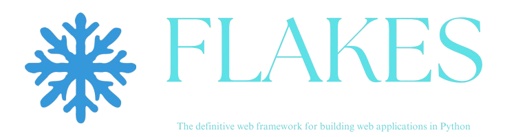

# Welcome to Flakes!

## What this is

Flakes is the definitive web framework for building web applications in Python. It takes inspiration from other web frameworks such as [NextJS](https://nextjs.org), [Svelte/SvelteKit](https://svelte.dev), and even some Python web frameworks such as [FastHTML](https://fastht.ml).

With Flakes, you can create fast, reactive, scaleable web applications in a syntax, which is nearly identical to Python, requirng minimal effort to learn, allowing you to spend more time coding.

## Core Features

-   :material-language-python:{ .lg .middle } __Written In Python__

    ---

    Install `flakes` with `pip`, or your prefered package manager, and get up
    and running in minutes.

    [:material-download: Installation](intro/installation.md)

-   :fontawesome-brands-markdown:{ .lg .middle } __Blazingly Fast__

    ---

    The dev server has a build time of around 100ms, blazingly fast, while still not comprimising quality.

    [:octicons-arrow-right-24: Reference](#)

-   :material-format-font:{ .lg .middle } __Made to measure__

    ---

    Change the colors, fonts, language, icons, logo and more with a few lines

    [:octicons-arrow-right-24: Customization](#)

-   :material-scale-balance:{ .lg .middle } __Open Source, MIT__

    ---

    Material for MkDocs is licensed under MIT and available on [GitHub]

    [:octicons-arrow-right-24: License](#)

## Project Background

Document is a WIP